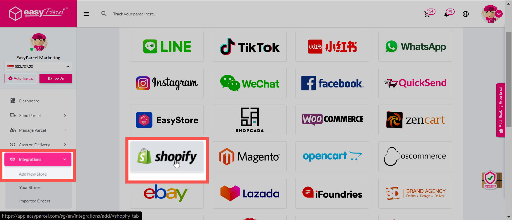
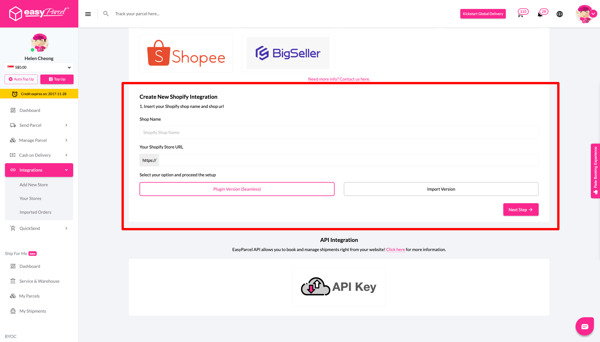
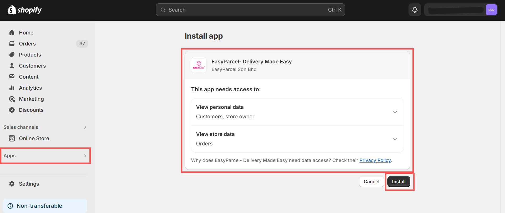
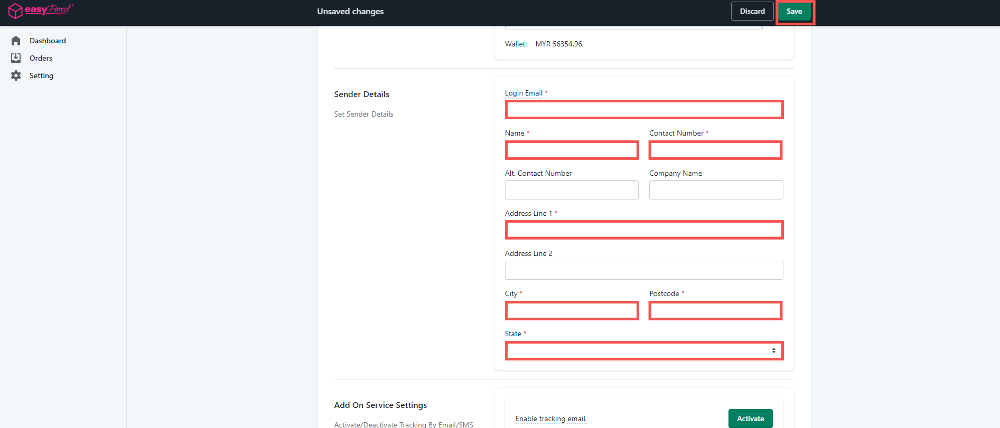

# How to Integrate EasyParcel with Shopify

## Table of Contents
- [Introduction](#introduction)  
- [Start Integrating and Choose Fulfillment Method](#start-integrating-and-choose-fulfillment-method)  
  - [Shopify APP Version (Seamless) - Recommended](#shopify-app-version-seamless---recommended)   
- [Notes](#notes)  

---

## Introduction
Hey, EasyParcel fam! This guide explains how to integrate your **EasyParcel account** with your **Shopify store**.  

By using the EasyParcel Shopify APP, you can enjoy:  

✔ **One-Click Bulk Fulfillment** – Fulfill single or bulk shipments with just one click.  
✔ **Live Rate at Checkout** – Real-time shipping rates displayed during checkout.  
✔ **Auto-generate Bulk Shipping Labels** – Create multiple shipping labels in a single step.  
✔ **Partial Order Fulfillment** – Ship what’s ready now, send the rest later.  
✔ **Auto Tracking Notifications (SMS, WhatsApp, Email)** – Keep customers informed and reduce inquiries.  
✔ **Compare 60+ Courier Options** – Quickly find the best shipping option for your business.  

---

## Start Integrating and Choose Fulfillment Method
Log into your EasyParcel account, go to **Integrations**, click **Add New Store**, and select **Shopify**.  

---

## Shopify APP Version (Seamless) - Recommended  
We highly recommend using the **EasyParcel Shopify APP**, as it enables:  

- Displaying live shipping rates on the Shopify checkout page.  
- Fulfillment of orders directly via the EasyParcel Shopify APP.  
- Automatic AWB generation and tracking.  
- Automatic update of Shopify order status to “fulfilled.”  
- Customizable AWB file names for smoother workflow.  

---

### Step 1  
Fill in your **Shop Name** and **Shopify Store URL**.  
Click **Next Step** to connect your Shopify store.  

  

---

### Step 2  
EasyParcel will redirect you to your Shopify store panel.  
A prompt will appear confirming successful integration. Click **OK**.  

  

---

### Step 3  
Go to your Shopify admin panel → **Apps** → Search for **EasyParcel - Delivery Made Easy** → Click **Install**.  

  

---

### Step 4  
You’ll be redirected to the EasyParcel settings under the **Getting Started** tab.  
Read through and click **Start Setup**.  

  

---

### Step 5  
Go to the **Shipping Setting** tab to fill in your details.  
- Select your shipping country.  
- Insert your **Integration ID** (copied from EasyParcel).  

  

---

### Step 6  
Review the auto-filled **Sender’s Details**.  
Edit if needed, then click **Save**.  

  

---

### Step 7  
In Shopify admin:  
- Go to **Settings** → **Checkout**.  
- Under **Shipping address phone number**, choose **Required**.  

⚠️ *If not set, the receiver_contact may be empty → AWB cannot be generated.*  

  

---

## Notes
- For **APP Version**, ensure customer phone numbers are required during checkout.  
- Integration is **free of charge**.   

