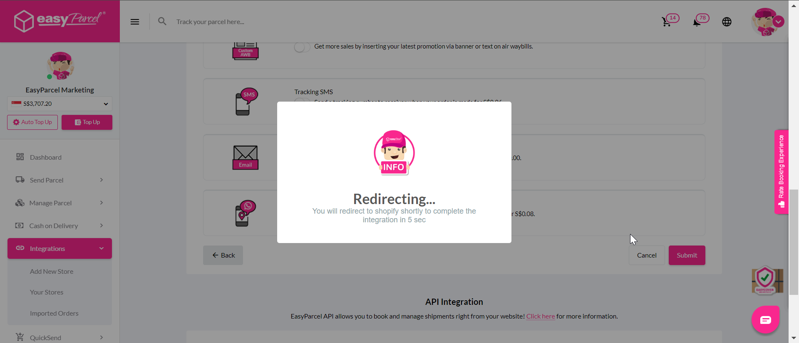
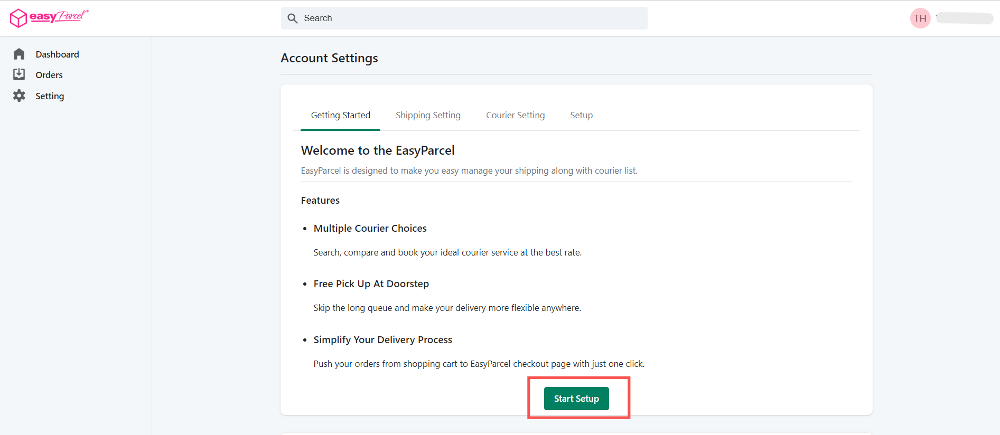
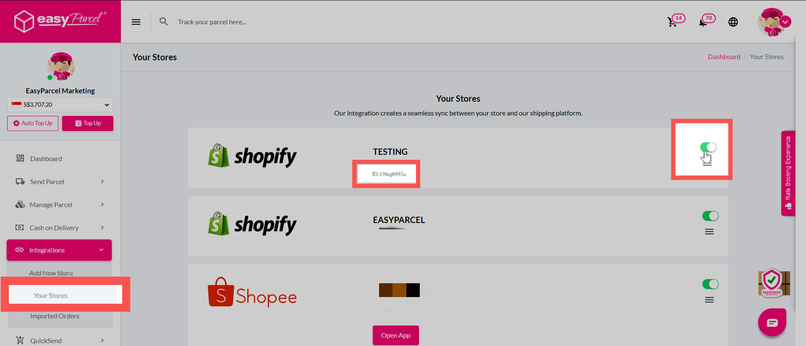
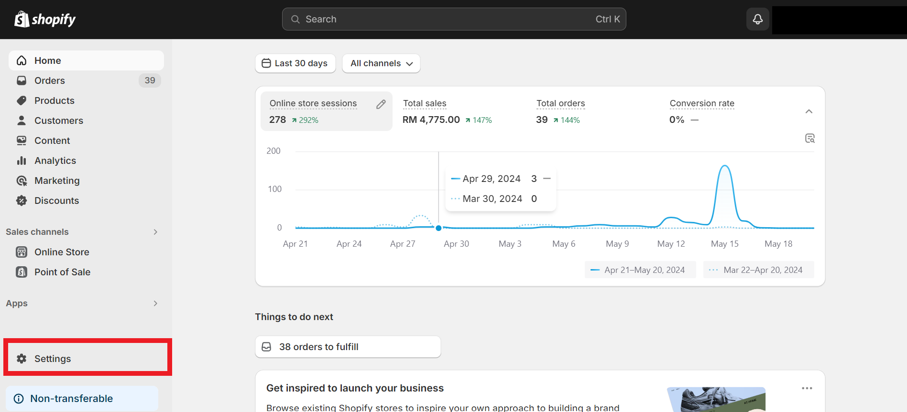

# EasyParcel Shopify Integration - App Setup 

---

## Introduction
This guide will walk you through integrating EasyParcel with Shopify using the App Version (Seamless) method. With this integration, you'll have a seamless experience with direct fulfillment from your Shopify App panel. 

---

### Set Up WooCommerce Integration
**Step 1:** [Log in to your EasyParcel account](https://account.easyparcel.com/login?client_id=c575e8cd-aa46-46db-8308-e18d25bb76c6&redirect_uri=https%3A%2F%2Fapp.easyparcel.com%2Feasyaccount%2Fcallback&state=eyJjbGllbnRfaWQiOiI1M2FmYmQzMS05OGI2LTQ3ODctOWYzOC1kMDY5ZGRkN2RiM2QiLCJyZWRpcmVjdF91cmkiOiJodHRwczovL2FwcC5lYXN5cGFyY2VsLmNvbS9sb2dpbi9vYXV0aC9jYWxsYmFjayIsInN0YXRlIjoie30iLCJjb3VudHJ5IjoibXkiLCJsYW5nIjoiZW4ifQ%3D%3D&country=my), go to 'Integration', click on '[Add New Store](https://app.easyparcel.com/my/en/integrations/add/)' and click 'Shopify'.

 

---

**Step 2:** Fill in your **Shop Name** and **Shopify Store URL**. Then, click **Next Step** to connect your Shopify store.  

  

---

**Step 3:** EasyParcel will redirect you to your Shopify store panel. 

  

A prompt will appear confirming successful integration. Click **OK**.  

  

---

**Step 4:** Go to your Shopify admin panel → **Apps** → Search for **EasyParcel - Delivery Made Easy** → Click **Install**.  

  

---

**Step 5:** You’ll be redirected to the EasyParcel settings under the **Getting Started** tab. Read through and click **Start Setup**.  

  

---

**Step 6:** Go to the **Shipping Setting** tab to fill in your details.  
- Select your shipping country.  
- Insert your **Integration ID** (copied from EasyParcel).  

  

Note: Copy your integration ID from here. You can access your integrated stores from '[Your Store](https://app.easyparcel.com/my/en/integrations/your-store/)'. 

  
---

**Step 7:** Review the auto-filled **Sender’s Details**.  
Edit if needed, then click **Save**.  

  

---

**Step 8:** In Shopify admin:  
- Go to **Settings** → **Checkout**.  
- Under **Shipping address phone number**, choose **Required**.  

⚠️ *If not set, the receiver_contact may be empty → AWB cannot be generated.*  

  

---

## Conclusion

You've successfully set up EasyParcel Shopify integration using the App Version (Seamless)! You will now can fulfill orders directly from your Shopify App panel. 

If you have any questions or need further assistance, [check out our other articles](https://helpcentre-my.easyparcel.com/support/home) or reach out to our friendly support team. We're happy to help you every step of the way! 

