# EasyParcel Shopify Integration - App Setup 

---

## Introduction
This guide will walk you through integrating EasyParcel with Shopify using the App Version (Seamless) method. With this integration, you'll have a seamless experience with direct fulfillment from your Shopify App panel. 

---

### Set Up Shopify Integration
**Step 1:** [Log in to your EasyParcel account](https://account.easyparcel.com/login?client_id=c575e8cd-aa46-46db-8308-e18d25bb76c6&redirect_uri=https%3A%2F%2Fapp.easyparcel.com%2Feasyaccount%2Fcallback&state=eyJjbGllbnRfaWQiOiI1M2FmYmQzMS05OGI2LTQ3ODctOWYzOC1kMDY5ZGRkN2RiM2QiLCJyZWRpcmVjdF91cmkiOiJodHRwczovL2FwcC5lYXN5cGFyY2VsLmNvbS9sb2dpbi9vYXV0aC9jYWxsYmFjayIsInN0YXRlIjoie30iLCJjb3VudHJ5IjoibXkiLCJsYW5nIjoiZW4ifQ%3D%3D&country=my), go to 'Integration', click on '[Add New Store](https://app.easyparcel.com/my/en/integrations/add/)' and click 'Shopify'.

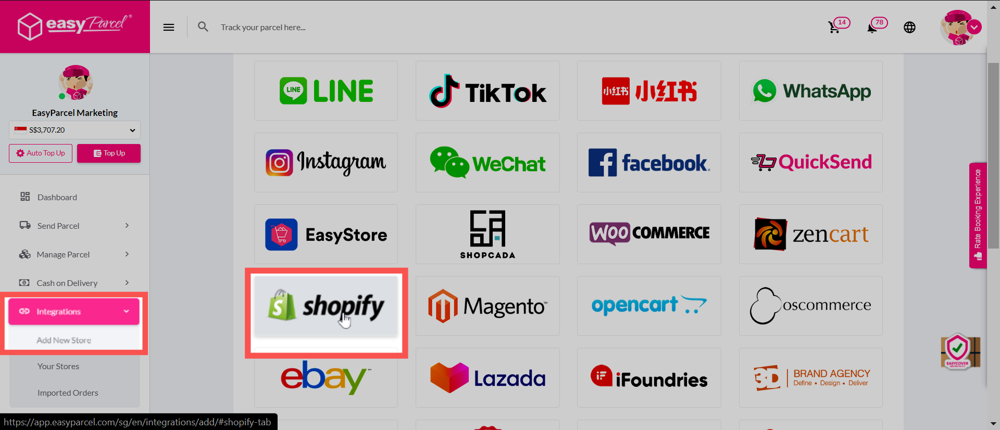 

---

**Step 2:** Fill in your **Shop Name** and **Shopify Store URL**. Then, click **Next Step** to connect your Shopify store.  

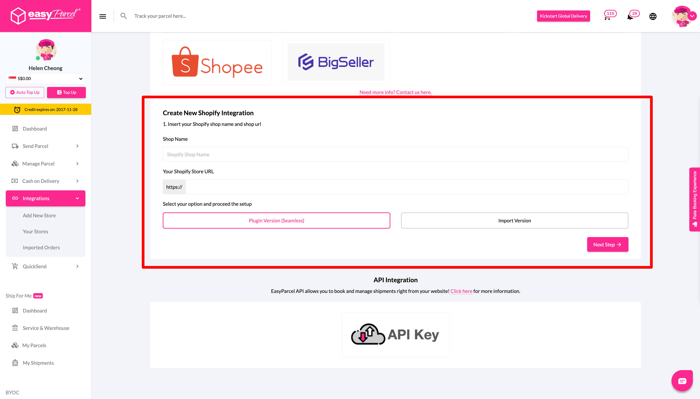  

---

**Step 3:** EasyParcel will redirect you to your Shopify store panel. 

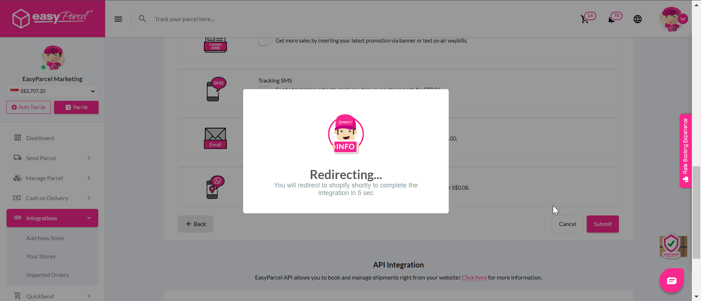  

A prompt will appear confirming successful integration. Click **OK**.  

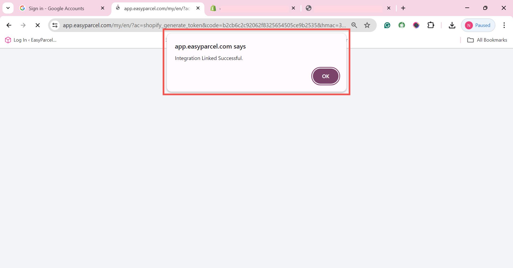  

---

**Step 4:** Go to your Shopify admin panel → **Apps** → Search for **EasyParcel - Delivery Made Easy** → Click **Install**.  

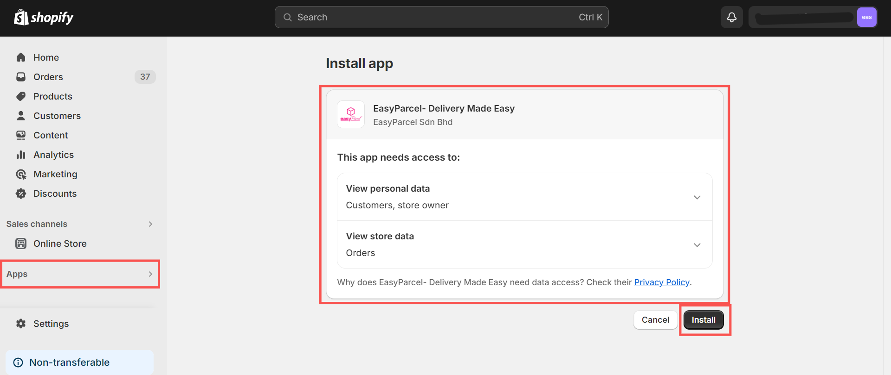  

---

**Step 5:** You’ll be redirected to the EasyParcel settings under the **Getting Started** tab. Read through and click **Start Setup**.  

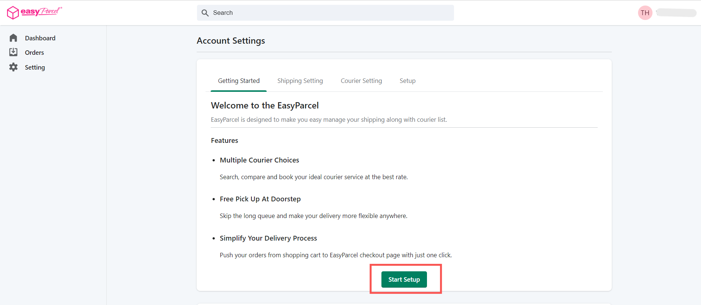  

---

**Step 6:** Go to the **Shipping Setting** tab to fill in your details.  
- Select your shipping country.  
- Insert your **Integration ID** (copied from EasyParcel).  

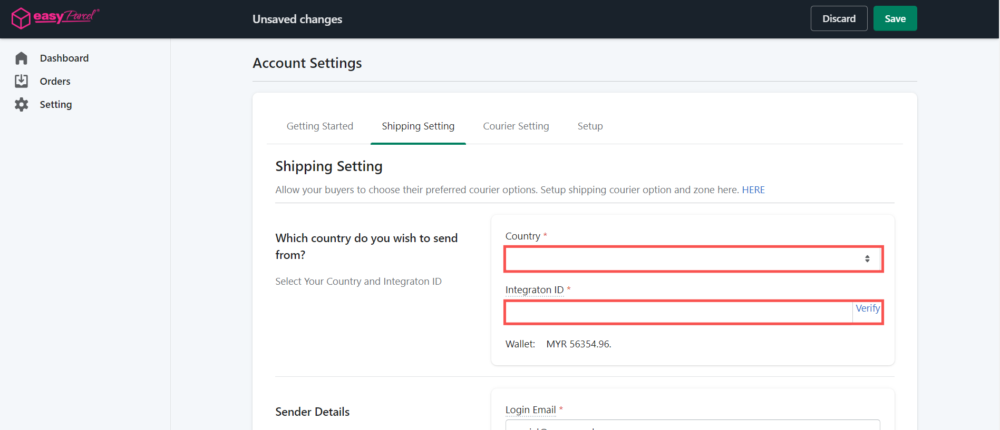  

Note: Copy your integration ID from here. You can access your integrated stores from '[Your Store](https://app.easyparcel.com/my/en/integrations/your-store/)'. 

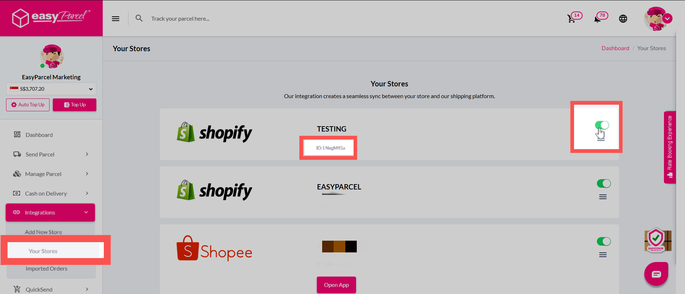  
---

**Step 7:** Review the auto-filled **Sender’s Details**.  
Edit if needed, then click **Save**.  

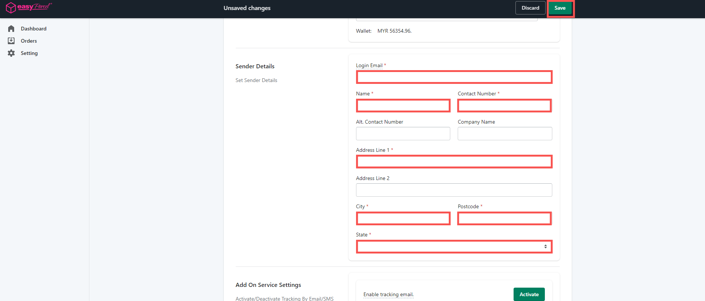  

---

**Step 8:** In Shopify admin:  
- Go to **Settings** → **Checkout**.  
- Under **Shipping address phone number**, choose **Required**.  

⚠️ *If not set, the receiver_contact may be empty → AWB cannot be generated.*  

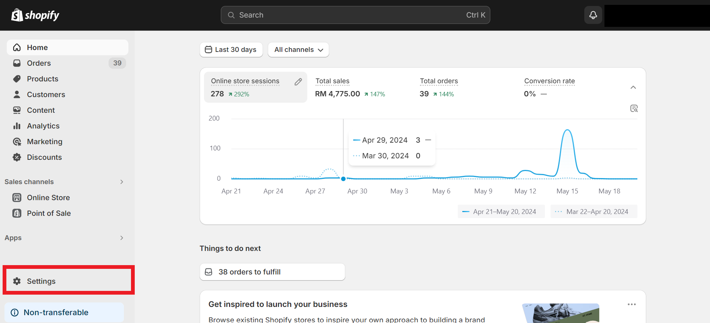  
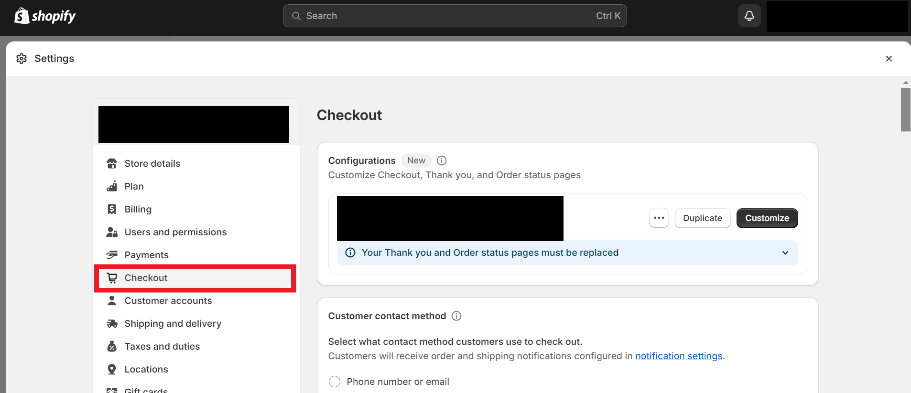
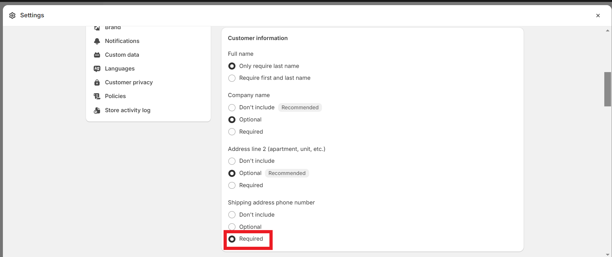

---

## How to fulfil Shopify orders via EasyParcel Shopify APP?

### 1: How to fulfill Shopify single orders?

**Step 1:** After a customer places an order in your Shopify store, ensure the order's payment status is "Paid.

**Step 2:** In your Shopify admin, click on "Apps" and select the "EasyParcel- Delivery Made Easy" app.

**Note:** If you haven't yet installed the EasyParcel Shopify app, refer to these instructions to learn more about integrating with EasyParcel.

**Step 3:** Sync and Select Order:

- Click on the "Orders" tab (or similar, depending on the app's interface).
- Click "Sync Orders from Shopify" to refresh the list of orders.
- Click on the order number you wish to fulfill.

**Step 4:** Fulfill Order:

- Enter the quantity of items you wish to ship.
- Click "Get Quote" to view available courier options and rates.
- Select your preferred courier service.
- Click "Fulfill Order" to complete the shipping process.

**Note:** You can choose drop-off service, you may choose your preferred drop-off location here.

**Step 5:** AWB auto-generated

- You can get the tracking number here
- Click 'Download AWB' to attach them on your parcels
- You may refer the tracking status of your order here too.

### 2: How to fulfill multiple Shopify orders at once?

**Step 1:** After a customer places an order in your Shopify store, ensure the order's payment status is "Paid.

**Step 2:** In your Shopify admin, click on "Apps" and select the "EasyParcel- Delivery Made Easy" app.

**Note:** If you haven't yet installed the EasyParcel Shopify app, refer to these instructions to learn more about integrating with EasyParcel.

**Step 3:** Select Orders

- In the "Orders" section, apply filters to find the orders you want to fulfill.
- Select the checkbox next to each order.
- Click "Fulfill Orders.

**Step 4:** Choose Courier and Pickup Date

- A pop-up window will appear. 
- Select your desired courier and pickup date. 
- Click "Submit."

**Step 5:** AWB Generation and Tracking

- Your Air Waybills (AWBs) will be generated automatically.
- You can find the tracking numbers on "Tracking Number" coulumn.
- Click "Download AWB" to print and attach the AWBs to your parcels.

**Step 6:** You may refer the tracking status of your order here

---

## Conclusion

You've successfully set up EasyParcel Shopify integration using the App Version (Seamless)! You will now can fulfill orders directly from your Shopify App panel. 

If you would like to add live rates to your Shopify checkout page, kindly refer to the following guide [How to Add Live Shipping Rates at Checkout for Shopify](https://github.com/easyparcel/classic-integration-doc/blob/main/sg/shopify/live_rates_setup.md).

If you have any questions or need further assistance, [check out our other articles](https://helpcentre-my.easyparcel.com/support/home) or reach out to our friendly support team. We're happy to help you every step of the way! 

